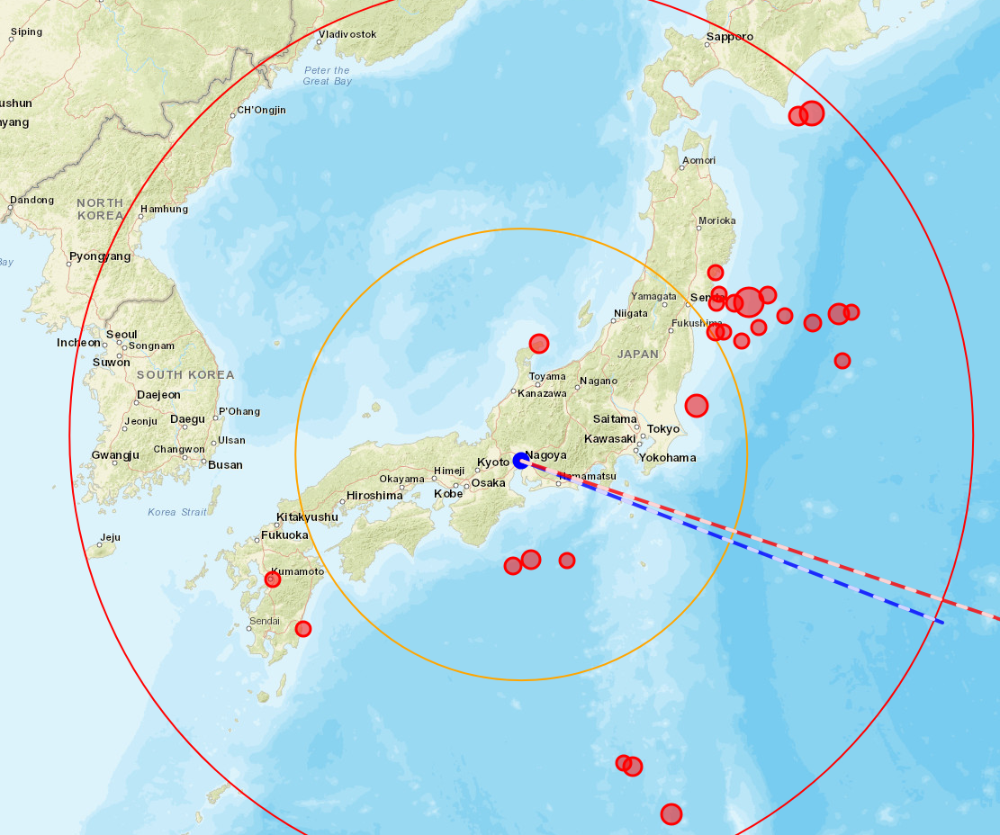
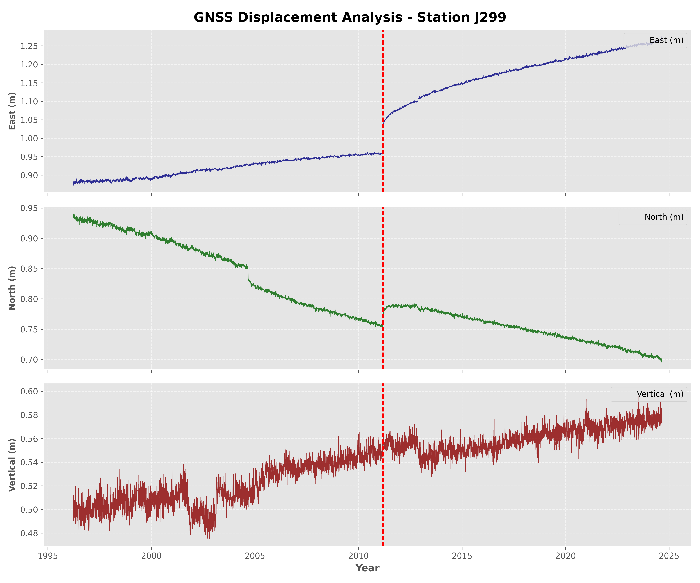

# Japan GNSS Tectonic Analysis Engine


## 📖 Project Overview

This project is a high-precision **geodetic analysis engine** designed to model crustal deformation in Japan. It processes raw GNSS (Global Navigation Satellite System) telemetry to isolate and visualize the impact of mega-thrust earthquakes on the Japanese archipelago.

The system focuses on **Station J299**, applying an **Extended Trajectory Model (ETM)** to separate secular tectonic velocity from sudden co-seismic displacements and long-term post-seismic relaxation.

---

## 🌍 Case Study: The 2011 Great Tohoku Earthquake

The core of this analysis centers on the **Tohoku Earthquake (Mw 9.1)**, which occurred on March 11, 2011. This was the most powerful earthquake ever recorded in Japan and the fourth most powerful in the world.

### 🗺️ Geospatial Intelligence Output
The engine generates a rich interactive map combining USGS seismic data with calculated displacement vectors.



**Key Visualizations:**
* **Blue Vector:** Represents the **Secular Velocity** (steady tectonic plate movement before the quake).
* **Red Vector:** Represents the massive **Co-seismic Jump** caused instantly by the Tohoku earthquake.
* **Red Circles:** Real-time query of major seismic events (> M7.0) fetched from the USGS API.
* **Context Rings:** Distance indicators (500km / 1000km) for spatial scale.

---

## 📊 Time-Series Analysis & Optimization

The project implements a custom mathematical model to fit the GNSS time series data (East, North, Vertical components).

### The Math Behind the Model
We solve for the trajectory $X(t)$ by optimizing parameters for:
1.  **Secular Velocity:** Linear trend due to plate tectonics.
2.  **Co-seismic Jumps:** Instantaneous offsets at the time of the earthquake ($t_{eq}$).
3.  **Post-seismic Relaxation:** Modeled using a logarithmic decay function:
    $$A \cdot \log(1 + \frac{t - t_{eq}}{T_{relax}})$$

### Grid Search Optimization
To determine the decay rate of the earth's crust, the script runs a **Grid Search Algorithm** that iteratively minimizes the Weighted Root Mean Square (WRMS) error, finding an optimal relaxation time ($T_{relax}$) of approximately **320.2 days**.


*Above: The generated plot showing the distinct "jump" in 2011 (Red dashed line) and the subsequent recovery curve.*

---

## ⚙️ Technical Environment

This project is built using **Python 3.12** and follows strict software engineering practices for reproducibility.

### Virtual Environment (`venv`)
To ensure a clean and isolated dependency tree, this project uses the native Python `venv` module instead of heavier alternatives like Anaconda. This guarantees that the project is lightweight and production-ready.

### Dependencies
The core logic relies on the following scientific stack (defined in `requirements.txt`):
* **`pandas`**: For high-performance ETL and time-series manipulation.
* **`numpy` / `scipy`**: For vector calculus and matrix operations.
* **`requests`**: For connecting to the USGS and Nevada Geodetic Lab APIs.
* **`folium`**: For geospatial mapping and vector rendering.
* **`plotly`**: For interactive data dashboards.

---

## 🚀 Getting Started

Follow these steps to deploy the analysis engine locally:

### 1. Clone and Setup
```bash
git clone [https://github.com/RicardoRamirez-gif/japan-gnss-analysis.git](https://github.com/RicardoRamirez-gif/japan-gnss-analysis.git)
cd japan-gnss-analysis

2. Create Virtual Environment

# Windows (PowerShell)
python -m venv venv
.\venv\Scripts\Activate

# Linux/Mac
python3 -m venv venv
source venv/bin/activate

3. Install Requirements
pip install -r requirements.txt

4. Run the Engine
python main.py
